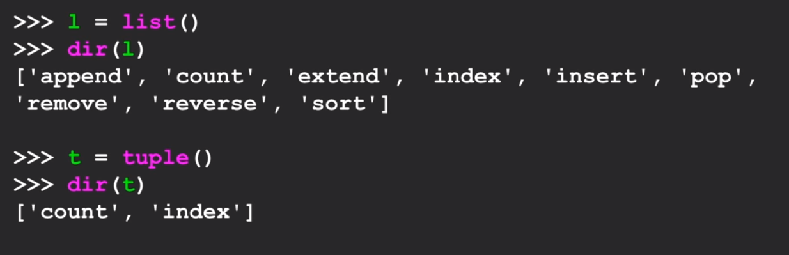

# Tuples
What are they:
- are like lists
- `can't be modified`
- indexed from 0

```python
#lists
x = [9, 8, 7]
x[2] = 6
print(x)
# [9, 8, 6]

#strings
v = "apple"
v[2] = l
# Error
# Traceback: 'str' does not support assignment

#tuples
t = (9, 8, 7)
t[2] = 6
# Error
# Traceback: 'tuple' does not support assignment
```

### Other things `not supported`
Tuple:
- sort()
- append()
- reverse()

Available functions in List vs Tuple



### Advantages
More Efficient
- simpler
- more efficient in terms of memory use and performance

Using tuple to assign multiple variables
```python
(x, y) = (44, 99)

print(y)
# 99
```

Tuples are comparable
- if first item is same
    - then it goes to next element
```python
(0, 1, 2) < (5, 1, 2)
# True
```

**Sorted()**
```python
c = {'a':10,'b':1,'c':22}
tmp = list()

for k, v in c.items():
    tmp.append((v, k))

print(tmp)
# [(10, 'a'), (1, 'b'), (22, 'c')]

tmp = sorted(tmp, reverse=True)
print(tmp)
# [(22, 'c'), (10, 'a'), (1, 'b')]
```


### Example
Print top 10 most common words
```python
name = input("Enter file:")
handle = open(name, 'r')

# Count word frequency
counts = dict()
for line in handle:
    words =  line.split()
    for word in words:
        counts[word] = counts.get(word, 0) + 1


lst = list()
for k, v in counts.items():
    new = (v, k)    # we reverse key and value so we can sort on the value
    lst.append(new)

lst = sorted(lst, reverse=True)

for v, k in lst[:10]:
    print(k, v)

```

> John Resig - Inventor of JQuery
>> "I kept wanting to have these certain utilities to make my development easier"
>> "just working around sort of like the browser incompatibilities that existed at the time"


> Douglas Crockford - Discovered JavaScript Object Notation (JSON)
>> "I started with JavaScript. But my first application was facilitating communication between programs written in JavaScript and servers written in Java."
>> "tried to make the simplest possible specification for how to structure data and put it on the wire. And that ultimately became called JSON"