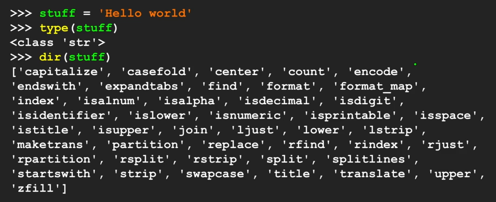

# Chapter 6
## Strings
- character data
- numbers can be treated as string
- string variable is a list

```python
greet = 'Ferrari'
# access 1st index element
print(greet[1]) # "e"
```

```python
str3 = '123'
x = int(str3) + 1
print(x)

# 124
```

 **Loop through String**

less efficient way
```python
i = 0
car = 'lamborghini'
while i < len(car):
    l = car[i]
    print(l)
    i += 1
```


More elegant way
```python
car = 'lamborghini'
for l in car:
    print(l)


#output
# l
# a
# m
# b
# o
# r
# g
# h
# i
# n
# i
```


**Count number of occurence**
```python
car = 'lamborghini'
count = 0

for l in car:
    if l == 'i':
        count += 1
print(count)
```

**Slicing Strings**
```python
car = 'lamborghini aventador'

print(car[0:4])
# lamb
# car[4] is not included

print(car[7:9])
# hi

print(car[18:33])
# dor
# there's only 20 chars, but there's no error when 33 is mentioned
```

## Manipulating Strings
**Concatenation**
`+` operator

```python
carBrand = 'lamborghini'
carModel = 'huracan'

car = carBrand + ' ' + carModel
print(car)
```

**Compare chars to String**
`in` operator

```python
carBrand = 'lamborghini'

'o' in carBrand
# True

'in' in carBrand
# True

if 'z' in carBrand:
    print('Found z in the string')

```

**Functions**

```python
carBrand = 'Lamborghini'

print(carBrand.lower())
#lamborghini

print(carBrand.upper())
#LAMBORGHINI

carBrand.endswith(suffix [, start [, end]])

carBrand.replace(old, new [, count])

carBrand.strip([chars])

```



**Searching in String**
```python
carBrand = 'Lamborghini'

pos = carBrand.find("hi")
print(pos)
# 7


pos = carBrand.find("z")
print(pos)
# -1

carBrand.startswith("L")
# True
```
